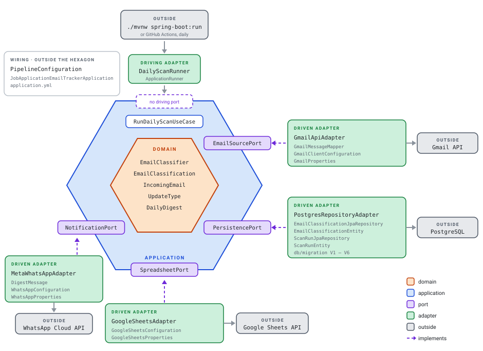

# job-application-email-tracker

A daily job that scans a Gmail inbox for emails about job applications, classifies them with rules written into its own code, saves the results in PostgreSQL, copies them into a Google Sheet, and sends a daily summary over WhatsApp.

It runs on GitHub Actions, with no server of its own. In production the database is on Neon, a hosted PostgreSQL on a free plan; for development, the same schema runs in a Docker container on your machine. Every service it uses is free.

See [`ARCHITECTURE.md`](./ARCHITECTURE.md) for the full design.

## Architecture



The four dashed arrows are what matters most in this diagram. Each one starts at an
adapter and ends at a port: the interfaces are declared on the inside, in the language of
the problem, and the code that talks to Gmail, PostgreSQL, Google Sheets and WhatsApp
adapts itself to them. Nothing in `domain` or `application` names a vendor, which is why
the whole daily run can be tested against lists in memory.

The empty dashed box on the top edge marks a port this project does not have. There are
two kinds of port: *driven* ports, which the application calls to reach the outside
world — the four above — and *driving* ports, which the outside world calls to start the
application. There is no driving port here: `DailyScanRunner` calls `RunDailyScanUseCase`
directly, because the only way in is running the job, on its schedule or by hand. A second
way in, such as an HTTP endpoint or a command-line command, is what would make an
interface worth having.

`PipelineConfiguration` sits outside the hexagon because its only job is to build the
objects and connect them, which is what lets `domain` and `application` carry no
framework annotation at all.

`application` holds the order of the steps and no business rules; `domain` holds the
rules and knows nothing about order, storage or the network.

## Requirements

- Java 25
- Docker (for the local PostgreSQL instance, and for Testcontainers during the build)

Maven itself is not needed: `./mvnw` downloads and runs the exact version set in the repository.

## Local setup

Create your `.env` from the template and fill in the blank password:

```bash
cp .env.example .env
```

Start the database and wait until it accepts connections:

```bash
docker compose up -d --wait
```

Only PostgreSQL runs in a container. The application runs directly on the JVM, both
locally and in CI — see [`ARCHITECTURE.md`](./ARCHITECTURE.md).

## How emails are classified

The classifier runs locally and matches the phrases hiring platforms use — "recebemos sua
candidatura", "infelizmente não seguiremos", "gostaríamos de convidá-lo" — plus the
sender's domain. There is no external service, no API key and no cost.

Emails that are not about a job application are dropped without being recorded, so
unrelated mail never reaches the database.

## Build & test

```bash
./mvnw clean verify
```

`./mvnw` is the Maven wrapper: a script kept in the repository that downloads and runs
the exact Maven version set in `.mvn/wrapper/maven-wrapper.properties`. You do not
need Maven installed, and this machine, anyone else's and CI all build with the same
version. The leading `./` matters — it means the script in this directory, not a command
on your `PATH`.

The integration tests start their own temporary PostgreSQL container, so
`docker compose` does not have to be running for them.

## Run locally

Flyway applies any pending migrations on startup:

```bash
set -a && source .env && set +a
./mvnw spring-boot:run
```

The database username and password have no default value: the application will not
start if `DATASOURCE_USERNAME` and `DATASOURCE_PASSWORD` are not set. The same holds for
`GMAIL_CLIENT_ID`, `GMAIL_CLIENT_SECRET` and `GMAIL_REFRESH_TOKEN`, and for
`WHATSAPP_ACCESS_TOKEN`, `WHATSAPP_PHONE_NUMBER_ID` and `WHATSAPP_RECIPIENT`.

## Running the scan

With the database up and the environment loaded, this reads the mailbox and stores what
it finds:

```bash
docker compose up -d --wait
set -a && source .env && set +a
./mvnw spring-boot:run
```

The application runs the scan once and exits — there is no server to leave running. It
logs how many emails it read, how many it stored, how many it had already seen, and how
many were not about a job application.

To start it without scanning, set `RUN_ON_STARTUP=false`.

## The daily run

`.github/workflows/daily-run.yml` runs the scan every day at 03:17 in São Paulo (06:17 UTC),
against a PostgreSQL database hosted on Neon rather than the local container. The hour is
early on purpose: GitHub starts scheduled runs late, sometimes by hours, and the digest
should reach the phone by 06:00. The run reads its configuration from these repository
secrets:

`DATASOURCE_URL` · `DATASOURCE_USERNAME` · `DATASOURCE_PASSWORD` ·
`GMAIL_CLIENT_ID` · `GMAIL_CLIENT_SECRET` · `GMAIL_REFRESH_TOKEN` ·
`GOOGLE_SHEETS_CREDENTIALS` · `GOOGLE_SHEETS_SPREADSHEET_ID` ·
`WHATSAPP_ACCESS_TOKEN` · `WHATSAPP_PHONE_NUMBER_ID` · `WHATSAPP_RECIPIENT`

The local `.env` keeps pointing at the local container, so a run started by hand never
writes to the real database.

**When a run fails**, a second job opens an issue labelled `daily-run-failure` and mentions
you in it, so GitHub notifies you. The title names the cause when the run can identify it — an
expired Gmail token, or WhatsApp refusing the token, access to the test number, or a
template that is not active yet — and the body links to the run and says what to do. While
that issue is open, later failures become comments on it rather than new issues. It
carries no text from the log, because on a public repository issues are public too.

To check that the alert reaches you, make a run fail on purpose. It stops before touching
the mailbox or the database:

```bash
gh workflow run daily-run.yml -f fail_on_purpose=true
```

**Renewing the Gmail token.** While the OAuth app is in Testing, Google expires the refresh
token every seven days, and the run fails with an issue titled *the Gmail token expired*.
Generate a new token, update the `GMAIL_REFRESH_TOKEN` secret, and start the workflow by
hand to confirm:

```bash
gh workflow run daily-run.yml
```

Nothing is lost in the meantime: the next run reads from where the last one finished,
however long ago that was.

## The spreadsheet

Classifications are mirrored into a Google Sheet, which is where notes written by hand
live — the database has no column for *what happened next*.

Setting it up:

1. Enable the Google Sheets API in the same Google Cloud project
2. Create a **service account** and download its JSON key
3. Create a spreadsheet, rename the first tab to `classifications`, and **share the
   spreadsheet with the service account's email address** as an editor
4. Add the first row by hand, as headers:
   `email · received at · sender domain · platform · company · role · update · urgent · subject`
5. Encode the key and put it in `.env`:

```bash
base64 -w0 service-account-key.json
```

A service account is an identity of its own rather than something acting on your behalf.
It reaches exactly the spreadsheets shared with it and nothing else, and it has no
consent that expires — so none of the token renewal that the mailbox needs applies here.

The first column is a link that opens the email in Gmail, so any row leads straight to the
message it came from.

Rows are appended, never rewritten. Column J onwards is left alone, which is where notes
belong.

## The WhatsApp digest

At the end of every run, whatever has not been reported yet goes out as one WhatsApp
message to your own number — every day, even when there is nothing new, so that a morning
without one means something failed. It is sent from Meta's free test number, through the
WhatsApp Cloud API, as the approved template `resumo_diario_acoes`:

```
Resumo diário das suas candidaturas, referente a {{1}}.

Este resumo reúne os e-mails sobre processos seletivos que chegaram desde o envio anterior, já classificados de forma automática.

Chegaram {{2}} e-mails sobre candidaturas. Divisão por tipo de retorno: {{3}}.

Pedem sua atenção, do mais importante para o menos importante. Cada item mostra o tipo de retorno, a plataforma ou o domínio de quem enviou, a data de chegada e o link que abre o e-mail direto no Gmail:
1) {{4}}
2) {{5}}
3) {{6}}
4) {{7}}
5) {{8}}
6) {{9}}
7) {{10}}
8) {{11}}
9) {{12}}
10) {{13}}

Além desses, também pedem atenção: {{14}}.

Propostas, testes técnicos, entrevistas, pedidos de informação e e-mails com prazo entram na lista. Confirmações de inscrição, recusas e e-mails sem categoria não entram, mas aparecem na contagem acima e ficam registrados na planilha de acompanhamento: {{15}}

Vagas sem item aparecem com um traço. Mensagem automática, enviada uma vez por dia.
```

The point of the message is what needs doing, not how much arrived. An offer, an interview,
a technical test, a request for information, or anything with a deadline is listed, most
important first, as one line with a link that opens that email in Gmail:

```
Entrevista · URGENTE · Gupy · 17/09 · https://mail.google.com/mail/u/0/#all/<id>
```

Confirmations and rejections are only counted: on a day of many applications they are most
of the mail, and would bury the one email that matters. Ten emails fit; beyond that the
message says how many more, and the spreadsheet has them all. A quiet day keeps the same
shape, with a dash in each place.

The message holds counts, dates, platform or sender domains and links to the emails —
never a subject, a sender's address or any text from a message. The classifications it
covers are marked as reported only after Meta accepts the message, so a delivery that
fails leaves them for the next run, and the period in the message grows to cover the days
that were missed.

Setting it up, once, on Meta's side:

1. Register as a Meta developer and create an app with the *Connect with customers
   through WhatsApp* use case.
2. In *Step 1 · Try it*, claim the free test number and add your own number as a
   recipient.
3. In WhatsApp Manager, on the test account, create `resumo_diario_acoes`: category
   Utility, language Portuguese (BR), variables of type *Number*, the text above, and a
   fixed header with no variable — the editor refuses an empty one.
4. In Business settings, add a system user with the Employee role, assign it the app and
   the test WhatsApp account, and generate a token that never expires, with only the
   `whatsapp_business_messaging` permission.
5. Put the token, the test number's Phone Number ID and your number, digits only, in
   `.env` and in the repository secrets.

## Checking against the real mailbox

Two tests read the real mailbox. Both run only when `GMAIL_REFRESH_TOKEN` is set, so CI
skips them.

**The credentials.** Prints how many emails were read and their sender domains — no
subjects, no bodies:

```bash
set -a && source .env && set +a
./mvnw test -Dtest=GmailApiManualVerificationTest
```

**The classifier.** Runs the rules over real mail and prints what they kept, so a person
can check what an invented test case cannot: whether the rules still match real emails.
Run it after any change to the classifier.

```bash
set -a && source .env && set +a
./mvnw test -Dtest=ClassifierAgainstRealMailboxTest -Dmailbox.days=90 -Dreport.dir=$HOME
```

Without `-Dreport.dir` it writes nothing to disk and prints only the summary and the kept
emails. With it, the full report — including the ignored ones, which is where a missed
application shows up — goes to a file in that directory, outside the repository.
