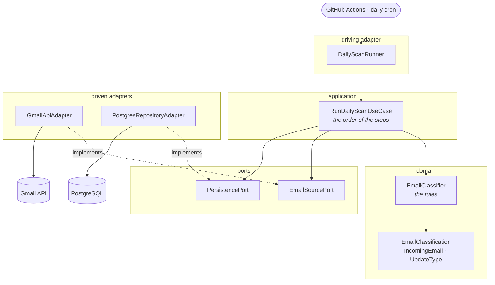

# job-application-email-tracker

A daily job that scans a Gmail inbox for emails about job applications, classifies them with a rules filter + Claude, saves the results in PostgreSQL, copies them into a Google Sheet, and sends a daily summary over WhatsApp.

See [`ARCHITECTURE.md`](./ARCHITECTURE.md) for the full design.

## Architecture



The two dotted arrows are the point. Everything else flows downward, but the adapters
point **back up** at the ports: the interfaces are declared on the inside, in the
language of the problem, and the code that talks to Gmail and PostgreSQL adapts itself to
them. Nothing in `domain` or `application` names a vendor, which is why the whole daily
run can be tested against two lists in memory.

`application` holds the order of the steps and no business rules; `domain` holds the
rules and knows nothing about order, storage or the network.

## Requirements

- Java 25
- Maven 3.9+
- Docker (for the local PostgreSQL instance, and for Testcontainers during the build)

## Local setup

Create your `.env` from the template and fill in the blank password:

```bash
cp .env.example .env
```

Start the database and wait until it accepts connections:

```bash
docker compose up -d --wait
```

Only PostgreSQL runs in a container. The application runs directly on the JVM, both
locally and in CI — see [`ARCHITECTURE.md`](./ARCHITECTURE.md).

## How emails are classified

The classifier runs locally and matches the phrases hiring platforms use — "recebemos sua
candidatura", "infelizmente não seguiremos", "gostaríamos de convidá-lo" — plus the
sender's domain. There is no external service, no API key and no cost.

Emails that are not about a job application are dropped without being recorded, so
unrelated mail never reaches the database.

## Build & test

```bash
mvn clean verify
```

The integration tests start their own temporary PostgreSQL container, so
`docker compose` does not have to be running for them.

## Run locally

Flyway applies any pending migrations on startup:

```bash
set -a && source .env && set +a
mvn spring-boot:run
```

The database username and password have no default value: the application will not
start if `DATASOURCE_USERNAME` and `DATASOURCE_PASSWORD` are not set. The same holds for
`GMAIL_CLIENT_ID`, `GMAIL_CLIENT_SECRET` and `GMAIL_REFRESH_TOKEN`.

## Running the scan

With the database up and the environment loaded, this reads the mailbox and stores what
it finds:

```bash
docker compose up -d --wait
set -a && source .env && set +a
mvn spring-boot:run
```

The application runs the scan once and exits — there is no server to leave running. It
logs how many emails it read, how many it stored, how many it had already seen, and how
many were not about a job application.

To start it without scanning, set `RUN_ON_STARTUP=false`.

## Checking the Gmail credentials

One test reads the real mailbox. It runs only when `GMAIL_REFRESH_TOKEN` is set, so CI
skips it:

```bash
set -a && source .env && set +a
mvn test -Dtest=GmailApiManualVerificationTest
```

It prints how many emails were read and their sender domains — no subjects, no bodies.
